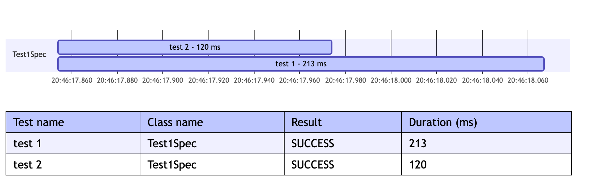
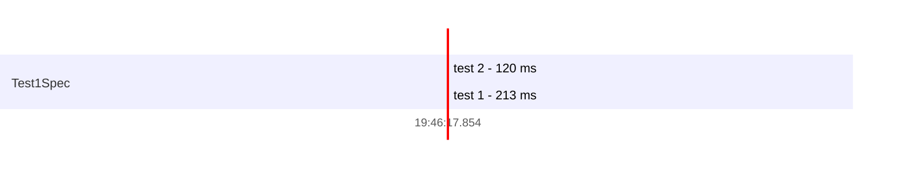

<p align="center">
    
</p>

**Gradle plugin that visualises tests execution schedule**

[](https://github.com/platan/tests-execution-chart/actions/workflows/ci.yml)

# Usage

> **Warning**
> This project is under development and has not yet been published to the Gradle Plugin Portal.

Since this project has not been published to the Gradle Plugin Portal you have to publish it locally to use it:

```sh
cd tests-execution-chart
./gradlew publish
```
Artifacts are published to `../local-plugin-repository` directory.

Configure your project:

`settings.gradle` (set proper path instead of `/path-to`):
```gradle
pluginManagement {
    repositories {
        maven {
            url '/path-to/local-plugin-repository'
        }
        gradlePluginPortal()
    }
}

```
`build.gradle`:
```gradle
plugins {
    id 'io.github.platan.tests-execution-chart' version '0.1.0-SNAPSHOT'
}
```

[//]: # (Gradle + Kotlin:)

[//]: # ()
[//]: # (```kotlin)

[//]: # (plugins {)

[//]: # (    id&#40;"io.github.platan.tests-execution-chart"&#41;)

[//]: # (})

[//]: # (```)

[//]: # ()
[//]: # (Gradle + Groovy:)

[//]: # ()
[//]: # (```gradle)

[//]: # (plugins {)

[//]: # (    id 'io.github.platan.tests-execution-chart')

[//]: # (})

[//]: # (```)

```sh
./gradlew test createTestsExecutionReport --rerun-tasks

#...

Tests execution schedule report saved to /my-project/build/reports/tests-execution/mermaid/test.txt file.
Tests execution schedule report saved to /my-project/build/reports/tests-execution/json/test.json file.
Tests execution schedule report saved to /my-project/build/reports/tests-execution/html/test.html file.
```

Example result (HTML report):

<p align="center">
    <picture>
      <source media="(prefers-color-scheme: dark)" srcset=".readme/example_dark.svg">
      
    </picture>
</p>

# Reports

`createTestsExecutionReport` task creates reports in HTML, JSON and [Mermaid](https://mermaid-js.github.io/mermaid/#/) formats.

## HTML
<picture>
      <source media="(prefers-color-scheme: dark)" srcset=".readme/example-html-report-dark.png">
      
</picture>

## JSON
```json
{
  "results": [
    {
      "className": "Test1Spec",
      "durationMs": 120,
      "endTime": 1667936777974,
      "startTime": 1667936777854,
      "resultType": "SUCCESS",
      "testName": "test 2"
    },
    {
      "className": "Test1Spec",
      "durationMs": 213,
      "endTime": 1667936778067,
      "startTime": 1667936777854,
      "resultType": "SUCCESS",
      "testName": "test 1"
    }
  ]
}
```

## Mermaid
```
gantt
dateFormat YYYY-MM-DD\THH\:mm\:ss\.SSSZ
axisFormat %H:%M:%S.%L
section Test1Spec
test 2 - 120 ms :active, 2022-11-08T20:46:17.854+0100, 2022-11-08T20:46:17.974+0100
test 1 - 213 ms :active, 2022-11-08T20:46:17.854+0100, 2022-11-08T20:46:18.067+0100
```

rendered: ([info](https://github.blog/2022-02-14-include-diagrams-markdown-files-mermaid/)):


# Configuration

Options:

| Key                         | Type    | Description                                                        | Default                                                    |
|-----------------------------|---------|--------------------------------------------------------------------|------------------------------------------------------------|
| `formats.json.enabled`      | boolean | Generate report in json format                                     | `true`                                                     |
| `formats.html.enabled`      | boolean | Generate report in html format                                     | `true`                                                     |
| `formats.html.script.src`   | url     | Url to mermaid which should be used to generate html report        | `https://cdn.jsdelivr.net/npm/mermaid/dist/mermaid.min.js` |
| `formats.html.script.embed` | boolean | If true mermaid source will be downloaded and used locally in html | `false`                                                    |
| `formats.mermaid.enabled`   | boolean | Generate report in mermaid text format                             | `true`                                                     |


`build.gradle.kts`:

```kotlin
configure<io.github.platan.tests_execution_chart.CreateTestsExecutionReportExtension> {
    formats {
        html {
            enabled.set(true)
            script {
                src.set("https://cdn.jsdelivr.net/npm/mermaid/dist/mermaid.min.js")
                embed.set(false)
            }
        }
        json {
            enabled.set(true)
        }
        mermaid {
            enabled.set(true)
        }
    }
}
```

`build.gradle`:

```gradle
createTestsExecutionReport {
    formats {
        json {
            enabled = true
        }
        html {
            enabled = true
            script {
                src = "https://cdn.jsdelivr.net/npm/mermaid/dist/mermaid.min.js"
                embed = false
            }
        }
        mermaid {
            enabled = true
        }
    }
}
```

# Motivation
[JUnit](https://junit.org/junit5/docs/5.9.0/user-guide/#writing-tests-parallel-execution) and [Spock](https://spockframework.org/spock/docs/2.3/parallel_execution.html) support parallel execution. Both frameworks allow to configure execution mode for classes/specifications and methods/features. JUnit/Spock documentation illustrates how this configuration affects the execution schedule of tests. 

Unfortunately I did not found existing tool which allows to visualise tests executions schedule for particular project. This Gradle plugin tries to address this need. 


<!-- add info regarding JUnit reports -->


# Changelog

## Unreleased

- Add option to create a report that visualises the tests execution schedule

# License

This project is licensed under the [MIT license](LICENSE).
